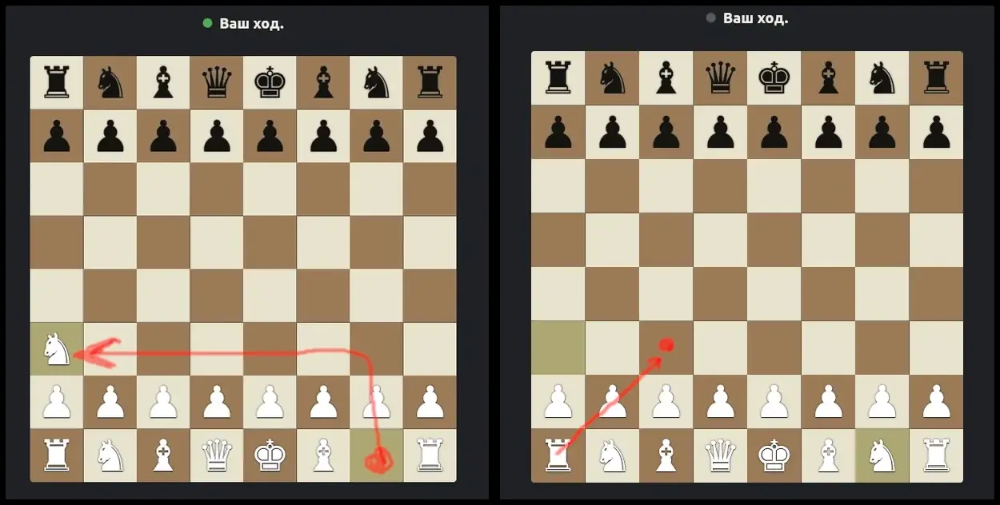

# Шахматы — VPN под видом шахматной игры

Кроссплатформенный VLESS / Reality VPN-клиент, который выглядит и играет как обычные
шахматы. Маскировка — **не от владельца**, а от посторонних, заглянувших в смартфон
(например, при уличной проверке в странах, где само наличие VPN-приложения создаёт
проблемы).



*Слева — конь включает VPN; справа — ладья открывает меню.*

## Управление

| Действие | Ход |
|---|---|
| Включить VPN | конём **g1 → a3** (невозможный ход — в обычной партии не случится) |
| Выключить VPN | конём **a3 → g1** |
| Меню / профили / настройки | ладьёй **a1 → c3** |

Точка-индикатор рядом с надписью хода: **серая** — выкл, **жёлтая** — подключение,
**зелёная** — подключено, **красная** — ошибка.

## Профили

Приложение поставляется **без серверов**. Каждый импортирует свою `vless://`-ссылку
через меню (ладья a1→c3 → «+»). Поддерживаются:
- **VLESS-over-WS-TLS** (`security=tls`)
- **VLESS-Reality** (`security=reality`) — маскирует SNI под чужой реальный сайт, устойчив к DPI

Проверка профилей («Проверить все») реально гоняет трафик сквозь туннель, а не просто
щупает порт. Маршрутизация настраивается: весь трафик через VPN / только список /
всё кроме списка (по IP, маске или домену).

## Платформы

| Платформа | Установка |
|---|---|
| **Android** | поставить APK (Releases) |
| **Windows** | распаковать zip, запустить `chess.exe` (при включении — один запрос UAC) |
| **Linux** | разовая установка хелпера (TUN нужен root) — см. ниже |

Готовые сборки — во вкладке **[Releases](../../releases)**.

## Сборка из исходников

Требуется [Flutter](https://flutter.dev) (стабильный канал).

### Windows
```
cd app
flutter build windows --release
```
Рядом с `chess.exe` положить `sing-box.exe` (ядро) и `wintun.dll`. Автосборка — в
`.github/workflows/windows.yml` (GitHub Actions).

### Linux
```
cd app
flutter build linux --release
sudo ../scripts/install-linux.sh        # выдаёт ядру cap_net_admin + polkit-правило на DNS
```
TUN-режиму нужны только сетевые capability (`cap_net_admin,cap_net_raw`), а не root:
установщик выдаёт их самому бинарю ядра, и приложение запускает его **под обычным
пользователем** — без sudo, без пароля и без привилегированного хелпера (раньше тут был
NOPASSWD-хелпер — это была дыра local-privilege-escalation, теперь убрана).
Запуск: `build/linux/x64/release/bundle/twomove`.

### Android
```
cd app
flutter build apk --release --split-per-abi
```
В репозитории лежит самосборная sing-box-библиотека `android/app/libs/libbox.aar`.

## Ядро

VPN-движок — самостоятельно собранный [sing-box](https://github.com/SagerNet/sing-box)
(диффится с upstream — без бэкдоров). Windows-ядро `desktop/sing-box.exe`,
Linux-ядро `desktop/sing-box`, Android — `libbox.aar`.

## Честно об ограничениях

Маскируется **приложение**, но операционная система всё равно показывает, что VPN
активен (значок в статус-баре, раздел VPN в настройках). Скрывается «что за приложение»,
а не «есть ли VPN-соединение». Глубокая криминалистика (Cellebrite и т.п.) — вне области
этой маскировки.
